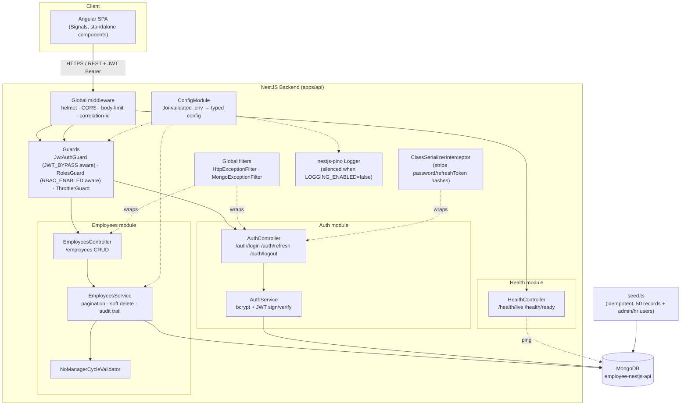
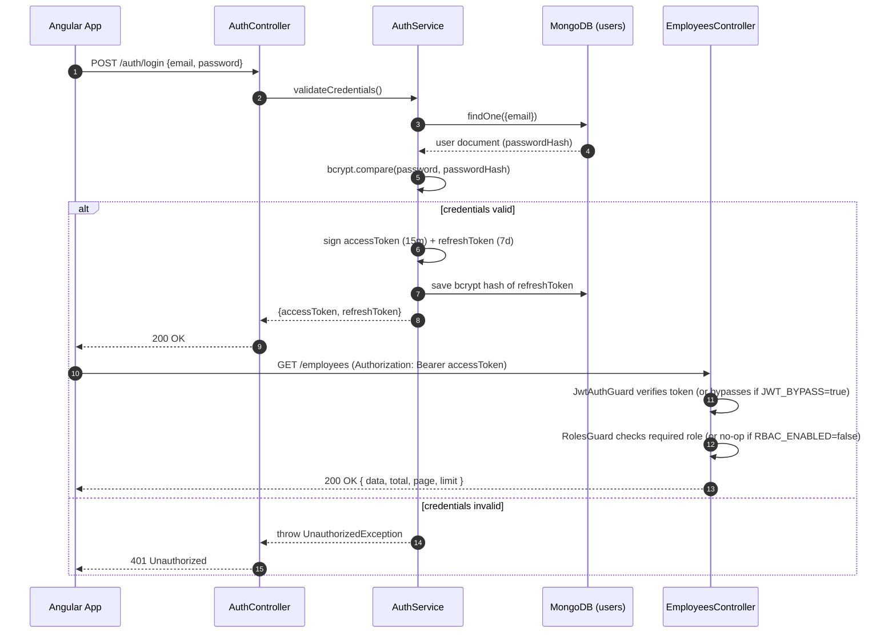
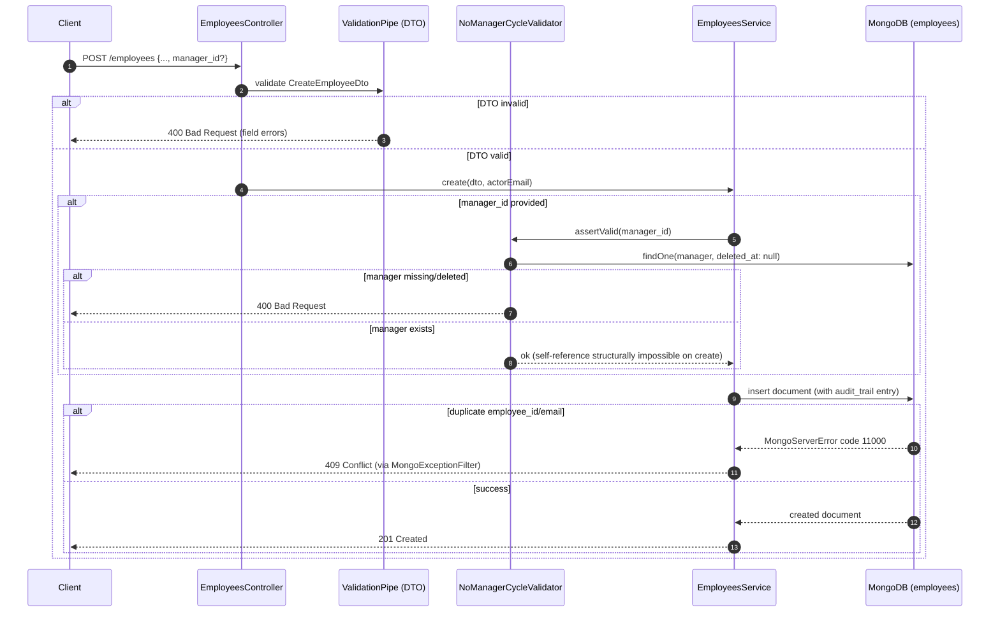
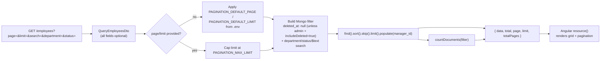
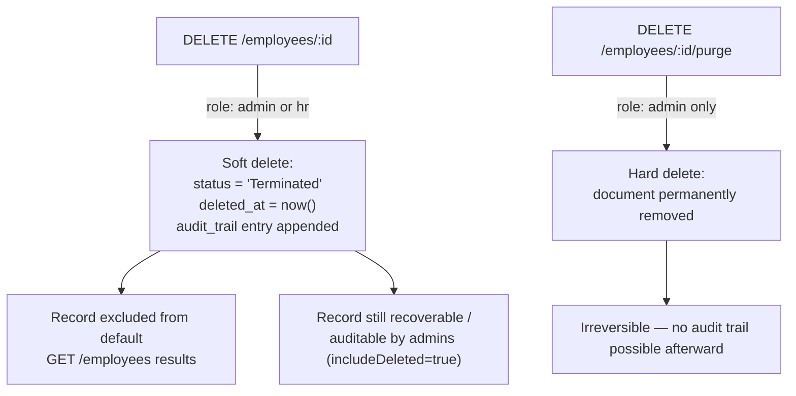
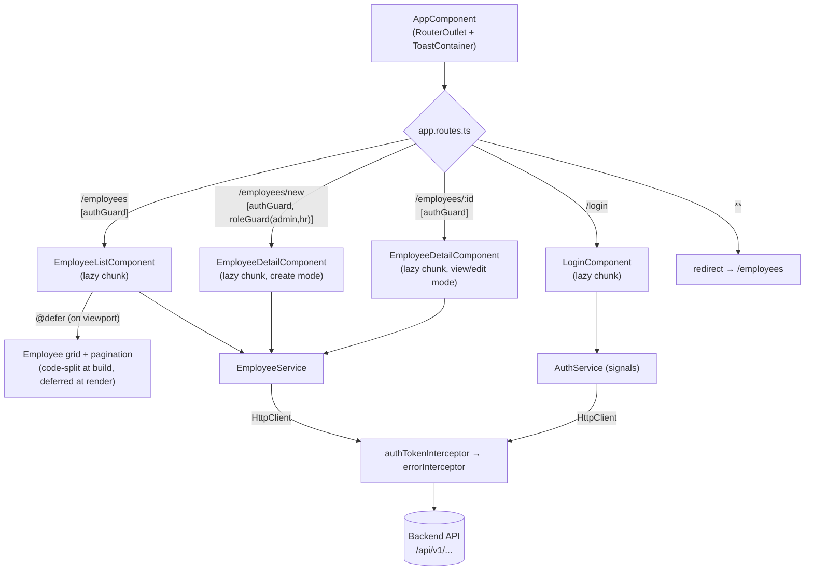
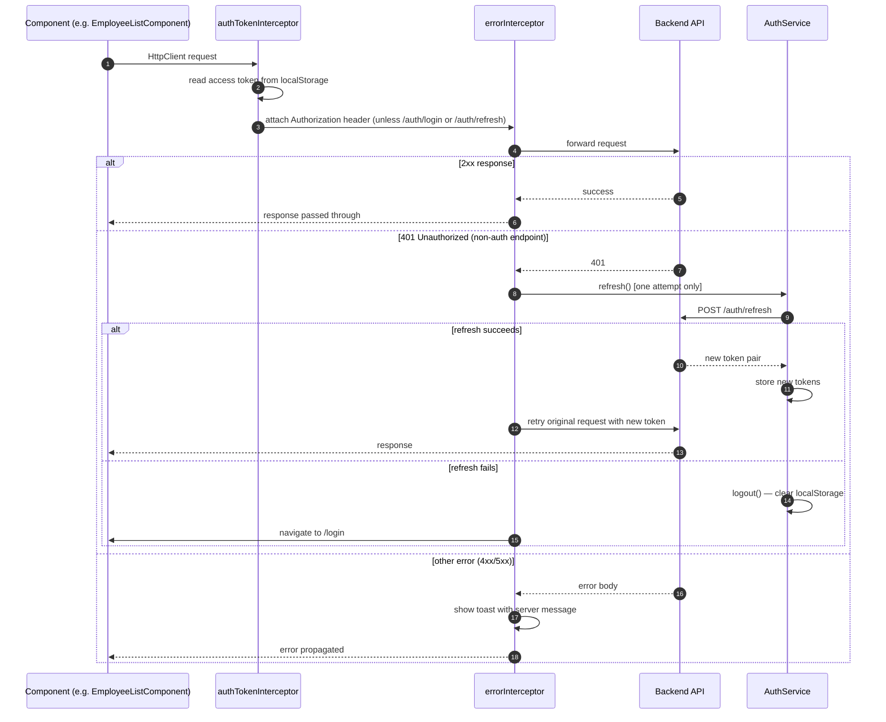
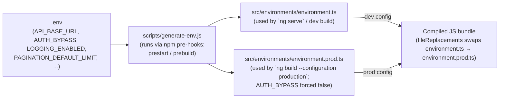
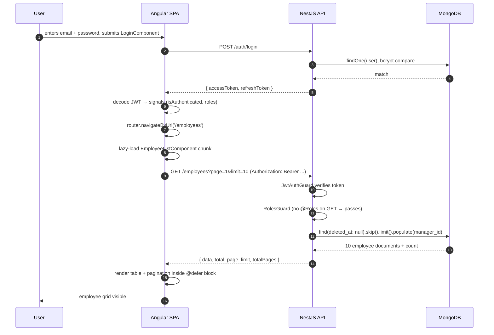
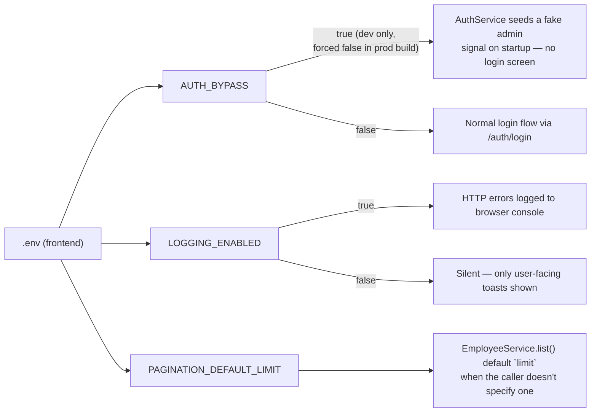

# Employee Management System — Architecture & Endpoint Flows

> Rendered natively by GitHub, GitLab, and most Markdown viewers. If your viewer doesn't support Mermaid, paste any block into https://mermaid.live.

## 1. System architecture



## 2. Login → protected request flow



## 3. Employee creation flow (with manager-cycle guard)



## 4. Paginated list flow



## 5. Soft delete vs. hard delete



## 7. Frontend route & lazy-loading structure



## 8. Frontend HTTP request lifecycle (interceptor chain)



## 9. `.env` → build-time configuration pipeline (frontend)



## 10. Full-stack login → list employees (end-to-end)



## 11. Backend request-level toggle matrix

```mermaid
    ENV --> RB["RBAC_ENABLED"]
    ENV --> LG["LOGGING_ENABLED"]
    ENV --> SW["SWAGGER_ENABLED"]
    ENV --> TH["THROTTLE_ENABLED"]
    ENV --> CO["CORS_ENABLED"]

    JB -->|true| J1["JwtAuthGuard injects a fake admin user,<br/>skips real token verification<br/>(blocked automatically in production)"]
    JB -->|false| J2["Standard Passport JWT verification"]

    RB -->|false| R1["RolesGuard is a no-op —<br/>any authenticated user passes"]
    RB -->|true| R2["RolesGuard enforces @Roles(...) per route"]

    LG -->|false| L1["pino logger level = silent"]
    LG -->|true| L2["Structured JSON logs with<br/>correlation IDs + redaction"]

    SW -->|false| S1["/api/docs not mounted"]
    SW -->|true| S2["Swagger UI served at SWAGGER_PATH"]

    TH -->|false| T1["Throttler limit effectively unlimited"]
    TH -->|true| T2["THROTTLE_LIMIT per THROTTLE_TTL enforced<br/>(tighter limits on /auth/*)"]
```

## 12. Frontend toggle matrix


