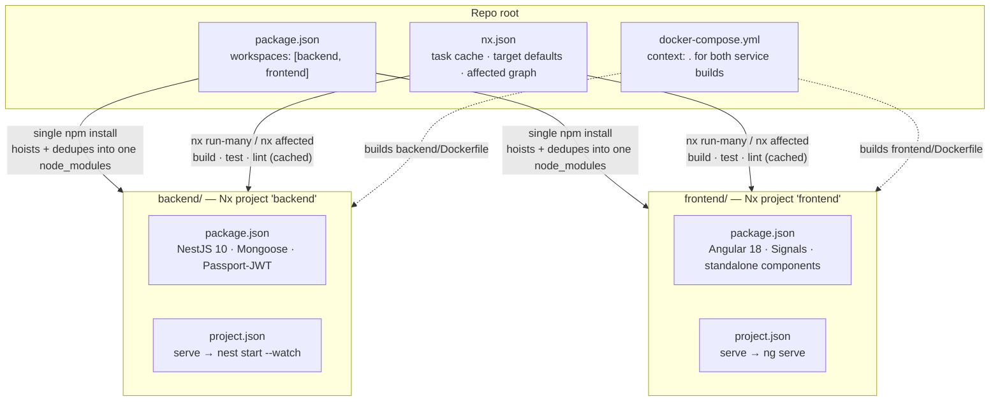
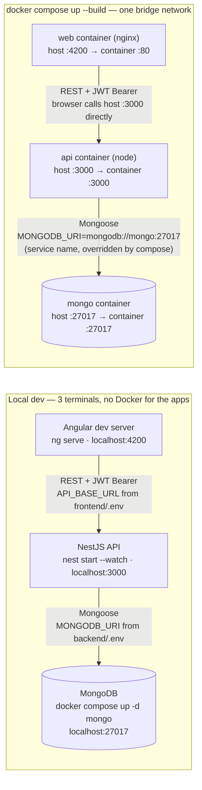
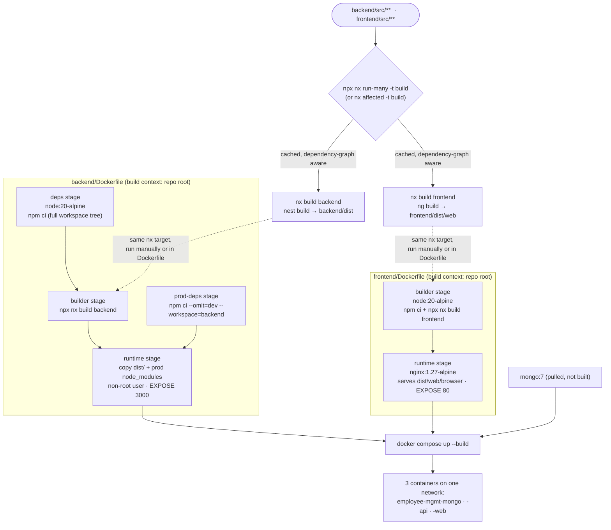

# nestjs-angular-employee-management-fullstack

Production-ready Employee Management System.

- `backend/` — NestJS + MongoDB API. See `backend/README.md` for full setup instructions.
- `frontend/` — Angular 18 (Signals, standalone components) SPA. See `frontend/README.md` for full setup instructions.
- `ARCHITECTURE.md` — system architecture and endpoint-flow diagrams (Mermaid) for both backend and frontend.
- `docker-compose.yml` — spins up MongoDB + the API + the frontend together.
- `package.json` / `nx.json` — root Nx workspace that orchestrates both apps (see [Monorepo tooling (Nx)](#monorepo-tooling-nx) below).

## How it fits together

Three views of the same monorepo: how the workspace is laid out, how the
two apps talk to each other and MongoDB at runtime, and how source becomes
running containers. For request-level flows (auth, RBAC, pagination, soft
delete, the frontend interceptor chain), see [ARCHITECTURE.md](ARCHITECTURE.md).

### 1. Monorepo layout (npm workspaces + Nx)



### 2. Runtime connectivity — local dev vs. Docker



### 3. Build pipeline — Nx targets → multi-stage Docker images



## Quick start (everything, via Docker)

```bash
git clone <this-repo>
cd nestjs-angular-employee-management-fullstack
cp backend/.env.example backend/.env      # edit JWT secrets etc.
cp frontend/.env.example frontend/.env    # defaults are fine for local docker-compose use
docker compose up --build
```

Then seed the database once the API is healthy. The containers only ship
production dependencies, so run the seed script from the host instead of
inside the `api` container (`backend/.env`'s `MONGODB_URI` already points at
the same Mongo that docker-compose exposes on `localhost:27017`):

```bash
npm install            # once, at the repo root — see Monorepo tooling (Nx)
npx nx run backend:db:seed
```

- Frontend: `http://localhost:4200`
- Backend API: `http://localhost:3000/api/v1`
- Swagger: `http://localhost:3000/api/docs`
- Log in with `admin@company.com` / `Admin@12345` (or `hr@company.com` / `HrUser@12345`)

## Quick start (local dev, without Docker)

```bash
npm install             # installs both workspaces from the repo root (Nx workspace)

# Terminal 1 — MongoDB
docker compose up -d mongo

# Terminal 2 — backend
cp backend/.env.example backend/.env
npx nx run backend:db:seed
npx nx serve backend

# Terminal 3 — frontend
cp frontend/.env.example frontend/.env
npx nx serve frontend
```

See `ARCHITECTURE.md` for how requests flow through auth, RBAC, pagination, soft delete, the frontend interceptor chain, and the `.env` → build-time config pipeline. See `backend/README.md` and `frontend/README.md` for every command and environment variable in detail.

## Monorepo tooling (Nx)

This repo is an [Nx](https://nx.dev) workspace built on top of **npm
workspaces** — `backend/` and `frontend/` stay exactly as they were (their
own `package.json`, their own Nest CLI / Angular CLI tooling, their own
scripts), but a single root install manages both, and Nx adds a shared task
runner with caching, parallel execution, and dependency-graph-aware commands
on top.

- `package.json` (root) — declares `"workspaces": ["backend", "frontend"]` so
  one `npm install` at the root installs and dedupes dependencies for both
  apps into a single `node_modules`.
- `nx.json` — configures Nx's task cache (`build`/`test`/`lint` are cached —
  re-running a command with no relevant changes replays the previous output
  instead of re-executing it).
- `backend/project.json` / `frontend/project.json` — give each app the short
  Nx project name (`backend`, `frontend`) used in the commands below, and add
  a `serve` target aliased to each app's own dev-server script.
- Every script already defined in `backend/package.json` and
  `frontend/package.json` (`build`, `test`, `lint`, `db:seed`, `build:dev`,
  etc.) is automatically available as an Nx target — `nx <script> <project>`.

### Install

```bash
npm install
```

Run once at the repo root. Do **not** run `npm install` from inside
`backend/` or `frontend/` — since they're workspace members, npm resolves
that back to the root install anyway.

### Everyday commands

```bash
# Dev servers
npx nx serve backend             # nest start --watch  (http://localhost:3000)
npx nx serve frontend            # ng serve             (http://localhost:4200)

# Build
npx nx build backend             # nest build -> backend/dist
npx nx build frontend            # ng build  -> frontend/dist/web
npx nx run-many -t build         # build both, in dependency order, with caching

# Test / lint
npx nx test backend              # jest
npx nx test frontend             # ng test (Karma + ChromeHeadless)
npx nx lint backend              # eslint
npx nx run-many -t test          # test both
npx nx run-many -t lint          # lint both

# Any other script from either package.json works the same way, e.g.:
npx nx run backend:db:seed       # ts-node src/seed/seed.ts
npx nx run frontend:build:dev    # ng build --configuration development
```

Or via the root `package.json` convenience scripts:

```bash
npm run serve:backend
npm run serve:frontend
npm run build          # nx run-many -t build
npm run test           # nx run-many -t test
npm run lint           # nx run-many -t lint
```

### Affected commands (git-aware)

`nx affected` only runs a target against projects impacted by your current
changes (diffed against a base branch), instead of both apps every time.
This **requires the repo to be a git repository with a base branch to diff
against** (e.g. `main`) — run `git init` and make an initial commit first if
you haven't already:

```bash
npx nx affected -t build
npx nx affected -t test
npx nx affected -t lint
```

### Inspecting the workspace

```bash
npx nx show projects        # list projects Nx has detected: backend, frontend
npx nx graph                 # open an interactive dependency-graph visualization
npx nx reset                 # clear the local Nx cache (troubleshooting)
```

### Docker

`docker-compose.yml` builds each image from the **repo root** as its build
context (`context: .`) rather than from `backend/`/`frontend/` individually,
because `npm ci` inside a workspace needs the root `package-lock.json` plus
every workspace's `package.json` to resolve correctly. Each Dockerfile still
produces the same minimal runtime image as before (only that service's
production dependencies end up in the final layer via `npm ci --omit=dev
--workspace=<name>`); `docker compose up --build` works exactly as documented
above.
